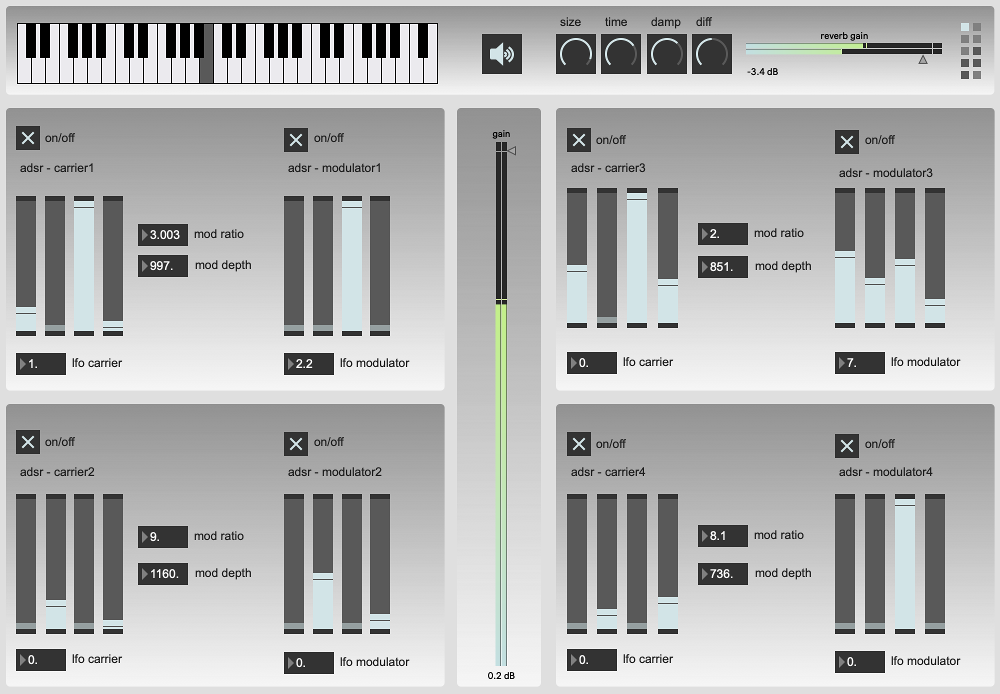
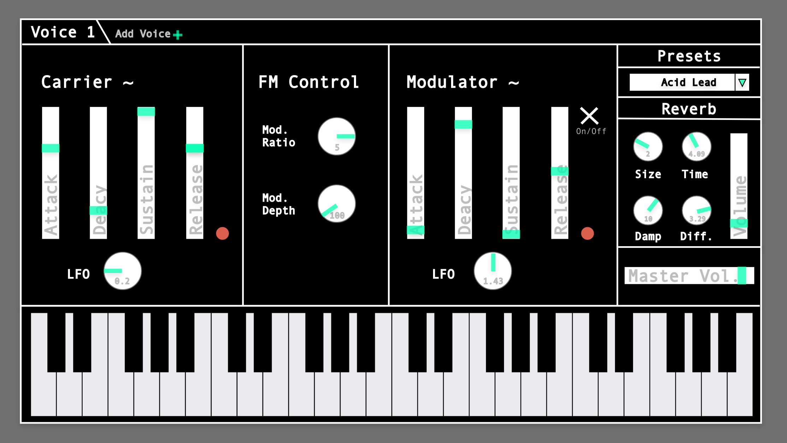
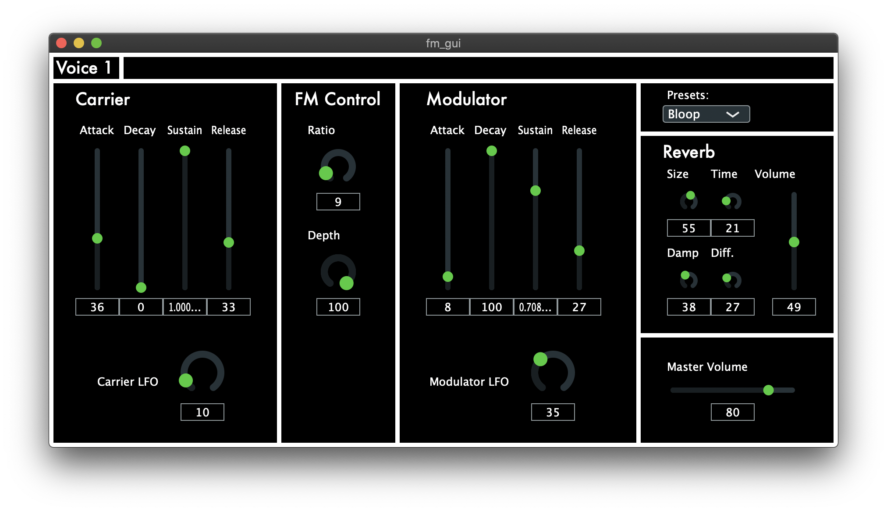

# Onderzoek eigen GUI

__FM Synthesizer - Gemaakt in MAX MSP__

**Hoe ervaar jij de gebruiker interactie met de app/plugin zoals deze nu is?**

Bij deze GUI is er niet expliciet nagedacht over de gebruikers interactie maar alleen over het organiseren en het er leuk uit laten zien van de parameters (en dit gebeurd helaas ook heel veel bij plugins die op de markt worden gebracht naar mijn idee).

De interactie verloopt wel redelijk, maar er zijn meerdere dingen die op een vreemde plek staan (deze benoem ik zo dadelijk). Verder ziet alles er wel uniform uit maar er wordt niet bij alles visuele feedback gegeven aan de gebruiker (bijvoorbeeld het verloop van de ADSR laten zien met een LED lampje of grafiek).

Ik ben van mening dat als je een klank gaat maken met een synthesizer dat je dit op een opbouwende manier doet. Dus om alle parameters in een keer “in your face” te krijgen (zoals bij deze GUI) kan dat overweldigende zijn. Zeker als je de synthesizer voor het eerst voor je krijgt. En op dat gebied hebben software synthesizers een groot voordeel. Want in software zou je dingen kunnen doen met “tabs” en “pop-ups” en dit kan bij een hardware synthesizer niet.

Voor iemand die weet hoe een FM synthesizer werkt, zal bij gebruik van deze GUI redelijk snel uit de voeten komen. Maar iemand die nog minder ervaring daarin heeft zal dit lastiger vinden. En dat is jammer want ik wil ook dat “beginners” met mijn software aan de haal kunnen.

**Welke GUI elementen werken goed? Hoe komt dat?**

Sommige delen zijn logisch ingedeeld:

*	Zo heeft elke voice een aparte panel (achtergrond) achter zich.

*	Elke sine wave heeft een LFO en die staat er ook duidelijk onder.

*	De on/off knoppen staan ook duidelijk boven de des betreffende sine wave.

*	De ADSR parameters van elke sine zijn sliders, dit is over het algemeen duidelijker dan 			draaiknoppen 	bij envelope parameters.

Deze onderdelen werken goed omdat ze goed geplaatst zijn, de dingen die bij elkaar horen 	staan ook daadwerkelijk bij elkaar. Dit is logisch en maakt het wat overzichtelijker.

Wat ook goed werkt is de visuele output in de gain slider en de reverb gain slider, dit kan heel handig zijn met troubleshooting. Als je geen audio hoort en je ziet dat er in de gain slider wel wat gebeurd dan licht het waarschijnlijk aan iets anders dan de synthesizer zelf.

**Welke GUI elementen werken nog niet goed (genoeg)? Hoe komt dat?**

*	Het klavier staat bovenin, dit is onlogisch omdat je traditioneel gezien bij synthesizers het 		klavier hebt en daarboven een “bak” met alle parameters.

*	De aan en uit knop van de audio staat naast de reverb parameters, die twee hebben niks 		met elkaar te maken. Bovendien is de aan en uit knop niet gelabeld, dus het is niet 			duidelijk wat het doet.

*	De volume slider staat mega groot en lang in het midden van de synthesizer, dit is geen 			logische plek. En omdat hij zo lang is kost het veel moeite om de slider van helemaal 			bovenin naar onder te bewegen, en dat is onnodig.

*	De number boxes kun je ook allemaal instellen met min getallen, dit is ongewenst i.v.m 			met de werking van de synthesizer.

*	Er is geen visuele feedback behalve dat de volume out in de gain slider en de gain slider 		van de reverb. Visuele feedback is prettig omdat je zo beter in de gaten hebt wat de 			synthesizer aan het doen is.

*	De range van de adsr envelope is al vastgesteld, dit kan vervelend zijn als je een klank wil 		maken waarbij een hele lange uitklank of hele langzame attack nodig is.

*	Je kunt bepaalde dingen aanzetten die je alleen hoort als je andere dingen aanzet.

*	Er staat nergens een naam of wat voor soort synth het is.

*	De number boxes zijn niet duidelijke parameters, een gebruiker die niet bekend is met 			MAX zal niet weten dat deze number boxes in principe ook “knoppen” zijn.

*	Rechts boven staat een kleine grid van vierkantjes, dit zijn ook knopjes voor het selecteren 	van presets. Hier staat echter niks bij, dus een gebruiker zal ook niet begrijpen waar deze  		grid voor dient.

**Als je meer tijd zou steken in het ontwerp en implementatie, wat zou je dan eerst veranderd? Waarom zou je dat als eerste veranderen?**

Ik zou als eerste het getoonde klavier naar de onderkant van de synth verplaatsen. Dit omdat traditioneel gezien bij synthesizers je het klavier hebt en daarboven een “bak” met alle parameters. En ook als je een Midi keyboard aan je computer hebt aangesloten staat deze vaak onder je beeldscherm en niet er boven. Dit zou ik als een van de eerste dingen veranderen omdat zo het overzicht wat duidelijker wordt.

Verder zou ik ook de lay-out veranderen zodat je maar 1 voice ziet met de desbetreffende parameters. En dat je nieuwe voices kan aanmaken met “tabs” zoals je bijvoorbeeld in je browser zou doen.
Ook zou je dan “tabs” hebben voor de reverb of andere effect paramaters.
Essentiële onderdelen zou ik wel altijd op de voorgrond willen hebben zoals het klavier, volume en preset paramaters.

**Zijn er leuke/interessante manieren van interactie met jouw app/plugin/etc. Die het gebruik van de app leuker/makkelijker kunnen maken?**

Wat leuk is aan deze GUI is dat het een uniforme uitstraling heeft, de kleuren zijn op elkaar afgestemd (zelfs de kleuren van de audio out in de gain sliders). En het is verder een strak ontwerp met meerdere rechthoeken als “secties” van de synthesizer.

Wat ook interessant is aan deze GUI is de realtime audio out in de gain sliders, zoals ik al eerder heb omschreven is dit handig met troubleshooting en het ziet er ook goed uit.

# Grafische mockup

__Mockup - gemaakt in Adobe XD__

**Onderbouwing ontwerpkeuzes mockup**

Ik heb de punten die ik hierboven heb genoemd in de mockup proberen te verwerken. Zo heb ik een “tabblad” design gemaakt voor de voices, als je op “Add Voice” zou klikken verschijnt er links boven in een nieuw tabje genaamd “Voice 2”. Zo is de synthesizer veel overzichtelijker.

Ook heb ik alle aparte secties duidelijk omlijnt en gelabeld met naam, ook dit heb ik gedaan voor gebruikers gemak en om het overzicht te bewaren.

Bij de knoppen zie je de waardes er in staan, dit kan handig zijn als je een precieze waarde zoekt zoals vaak bij de FM ratio nodig is.

Alle parameters die de gebruiker kan gebruiken zijn dezelfde kleur groen gemaakt, dit omdat het zo uitnodigt om aan de knoppen en sliders te zitten en om er mee te gaan spelen. Maar ook is dit weer een stukje overzicht, omdat je zo in een oog opslag ziet wat de knoppen en sliders zijn waar je iets mee kan doen.

Je ziet in de mockup een rood puntje naast de envelope’s staan, dit moet een digitaal LED lampje voorstellen. Deze zou met het verloop van de adsr envelope meegaan met lichts intensiteit. Zo krijgt de gebruiker ook wat visuele feedback van het verloop van de envelope.

Zoals je ziet is het klavier ook aan de onderkant geplaatst en de presets hebben ook een duidelijkere plek gekregen (ik heb al eerder uitgelegd waarom ik dit wilde doen).

Verder heb ik de synthesizer redelijk minimalistisch proberen te houden wat betreft kleur en tekst. Niet teveel kleuren door elkaar heen, en ook niet te veel tekst over de gehele synthesizer. Dit is van de ene kant een kwestie van smaak maar ook van de andere kant een kwestie van overzichtelijkheid.

# Prototype

**Keuze library en taal**

De library die ik gekozen heb voor mijn prototype is JUCE (C++). Dit met als reden dat als ik ooit van de synthesizer een plugin zou willen maken, dan heb ik alvast de basis van de GUI klaarstaan.

**Process**

Dit was de eerste keer dat ik met JUCE heb gewerkt dus het was in het begin even stoeien met hoe alles werkt.
Maar ik ben blij met het eindresultaat van het prototype. Echter zitten er helaas niet alle features in die ik had bedacht voor de mockup (dit omdat er maar 1 week tijd voor was), maar de basis staat wel. Wat er helaas niet in zit is de “tabbladen” functie voor extra voices, de LED lampjes bij de envelope, het midi keyboard onderin en de looks van de parameters zijn wat anders dan bij de mockup. Dit zouden ook de eerste dingen zijn die ik er aan toevoeg als ik dit project weer zou oppakken en er mee verder zou gaan.

De code voor de GUI is ook volgens OOP richtlijnen gemaakt, dit vond ik zelf ook een fijne manier van werken.

Ik heb bijvoorbeeld een ADSR envelope in een aparte component gemaakt met 4 sliders en de verhouding, locatie en grootte van de sliders bepaald in de component. En daarna kun je dus zoveel ADSR envelope’s aanmaken in je main component als je maar wil. Zo kun je ook deze gehele “GUI module” compleet verplaatsen binnen je applicatie. En dit heb ik gedaan voor alle onderdelen van de synthesizer.

**Code**

https://github.com/Freekheldens/CSD2/tree/master/csd2d/gui/fm_gui/Source
